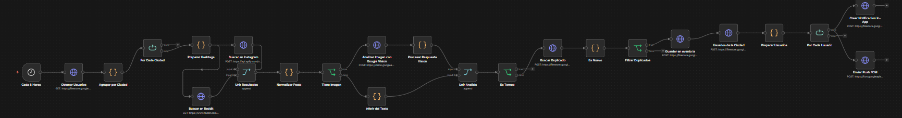

- Brawl TCG

Plataforma móvil para la gestión y descubrimiento de torneos de juegos de cartas coleccionables (TCG).

- ¿Qué es?

Brawl TCG conecta a jugadores con torneos locales y permite a los organizadores de estos crear y gestionar sus propios eventos. Soporta múltiples juegos: Magic: The Gathering, Pokémon, Yu-Gi-Oh!, Flesh & Blood, Lorcana y One Piece TCG.

- Tecnologías

Frontend: Flutter (Dart)
Backend: Firebase (Auth, Firestore)
API: Python y FastAPI
Reglas (scraping): BeautifulSoup y requests 

- Funcionalidades principales

Jugadores
- Explorar y registrarse en torneos cercanos
- Ver ubicaciones en mapa
- Consultar reglas oficiales de cada juego
- Notificaciones de eventos

Organizadores
- Crear y gestionar torneos
- Ver inscripciones y estadísticas
- Gestionar tienda y premios

Compartido
- Login con email o Google
- Perfil de usuario
- Configuración de idioma y apariencia

- Estructura del proyecto

lib/
├── features/      # Módulos por funcionalidad (eventos, reglas, mapa, tienda…)
├── core/          # Tema, colores, navegación
├── shell/         # Layout según rol (jugador / organizador)
├── models/        # Modelos de datos
└── main.dart      # Punto de entrada

api/
├── routers/       # Rutas FastAPI
├── scrapers/      # Scrapers de reglas por juego
└── main.py        # Servidor

- Requisitos

    - Flutter SDK >= 3.9.2
    - Dart SDK >= 3.9.2
    - Python 3.9+
    - Proyecto Firebase configurado

- Guía rápida

1. Inicia sesión con la cuenta admin@admin.com y contraseña admin1 como Jugador, o admin@gmail.com y contraseña admin2 como Organizador
2. En la pantalla de Eventos, explora los torneos disponibles y filtra por juego o ubicación.
3. Pulsa en un torneo para ver sus detalles y pulsa Inscribirse para apuntarte.
4. En el Mapa puedes ver dónde se celebran los eventos cerca de ti.
5. En Reglas selecciona tu juego para consultar las reglas oficiales.
6. En Perfil puedes editar tus datos, cambiar el idioma y el aspecto de la app.

- Instalación

En la terminal:

# App Flutter
flutter pub get
flutter run

# API Python
pip install -r api/requirements.txt
uvicorn api.main:app --reload

